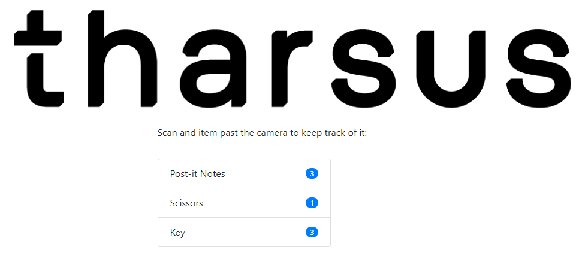

# Item Scanner Using Machine Learning

This mini project uses a Machine Learning model running on a Raspberry Pi to
identify and "scan" items as they are passed infront of the camera.

## Installation
- Install Poetry
- Run `poetry intstall` in the root directory
- Activate the created venv and mannual `pip install` tensorflow
- At this point you can run `./run_server` and connect to the IP address of the Pi to test things out
- Optionally, install the `scanner.service` to run automatically